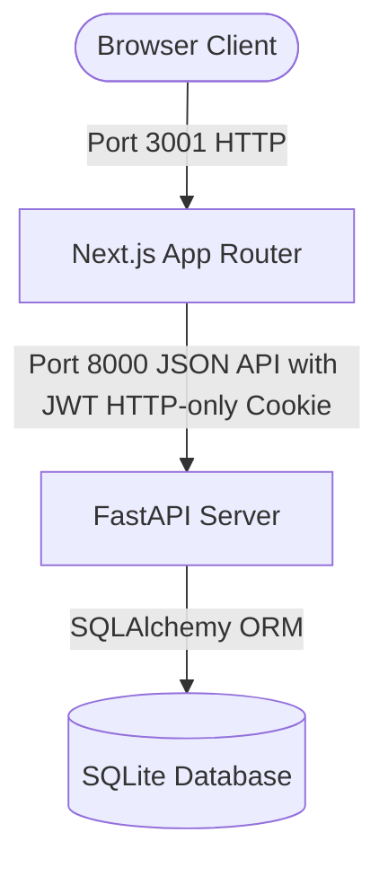
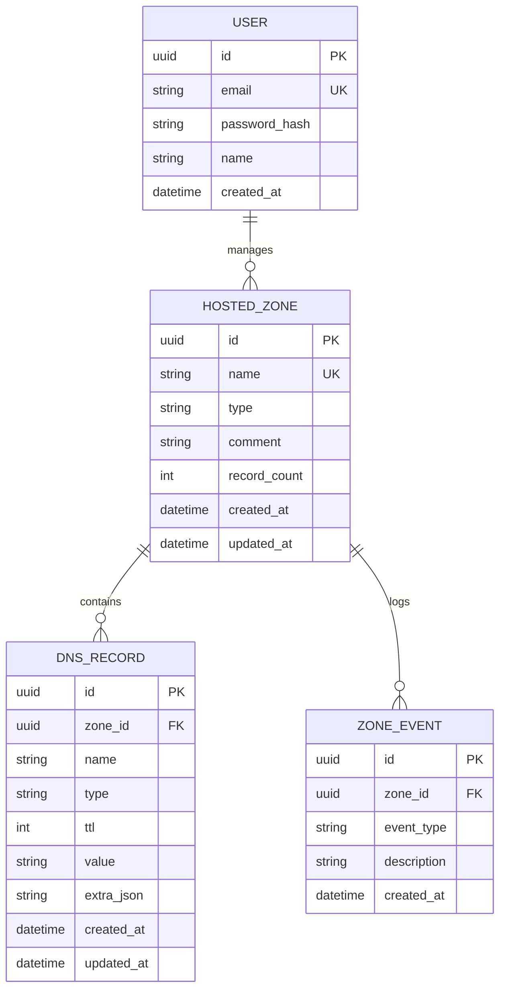
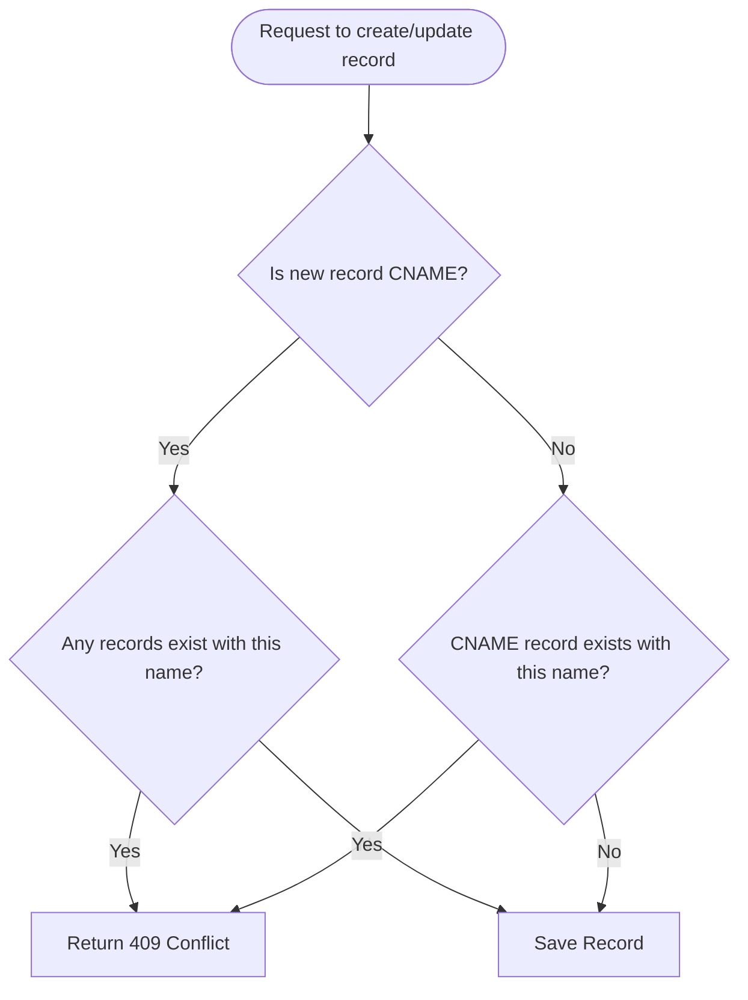
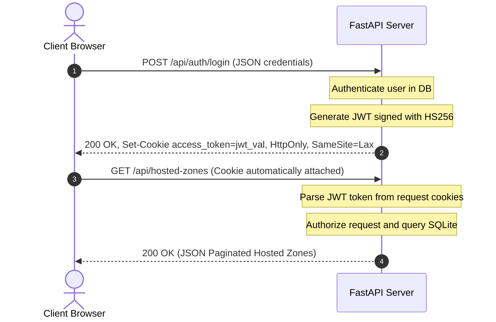
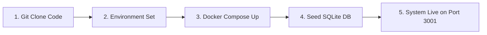

# AWS Route53 Clone Console

This project is a high-fidelity systems-design clone of the AWS Route53 web management console. It is designed to replicate the user experience, core workflows, and layout structures of the official Route53 administration portal. It provides complete hosted zone administration and DNS record set management. It is explicitly not a functional DNS nameserver: it does not serve zone files, resolve DNS queries over UDP/TCP port 53, support DNSSEC, or integrate directly with registrar domain booking APIs. The application includes a mock DNS Query Simulator sandbox to resolve local queries (including CNAME chasing and wildcard matching) inside the console, but it does not act as a real DNS resolver for external networks. Authentication is fully modeled using hashed credentials and JWT tokens stored in secure cookies, and all administrative data is persisted in a local relational schema.

---

## 1. Requirements Traceability Matrix

| Spec Requirement | Status | Codebase Location |
| :--- | :--- | :--- |
| Login / Logout / Session persistence | Implemented | backend/app/routers/auth.py, frontend/src/lib/auth.tsx |
| Hosted Zones - View/Search/Create/Edit/Delete | Implemented | backend/app/routers/hosted_zones.py, frontend/src/app/(dashboard)/hosted-zones/ |
| DNS Records - all 9 types (A, AAAA, CNAME, TXT, MX, NS, PTR, SRV, CAA) | Implemented | backend/app/services/dns_validators.py, backend/app/routers/dns_records.py |
| Search, Filters, Pagination | Implemented | backend/app/services/zone_service.py, backend/app/services/dns_record_service.py, frontend/src/components/ui/Pagination.tsx |
| Modals, Notifications | Implemented | frontend/src/components/ui/Modal.tsx, frontend/src/components/ui/Toast.tsx |
| Dashboard | Implemented | frontend/src/app/(dashboard)/dashboard/page.tsx |
| Traffic Policies | Scoped Out | frontend/src/app/(dashboard)/traffic-policies/page.tsx (Coming Soon Page) |
| Health Checks | Scoped Out | frontend/src/app/(dashboard)/health-checks/page.tsx (Coming Soon Page) |
| Resolver (Inbound/Outbound) | Scoped Out | frontend/src/app/(dashboard)/resolver/ (Coming Soon Page) |
| Profiles | Scoped Out | frontend/src/app/(dashboard)/profiles/page.tsx (Coming Soon Page) |
| BIND import/export | Not Implemented | Scoped Out |
| DNS Query Simulator (Sandbox) | Implemented | backend/app/routers/query_simulator.py, frontend/src/app/(dashboard)/dns-test/ |
| Dark mode | Implemented | frontend/src/components/ui/TopNav.tsx, frontend/src/app/globals.css |
| Keyboard shortcuts | Implemented | frontend/src/app/(dashboard)/layout.tsx |
| Bulk operations (Bulk Delete Zones) | Implemented | frontend/src/app/(dashboard)/hosted-zones/page.tsx |

---

## 2. Live Demo

* **Frontend Console URL**: http://20.205.16.177:3001
* **Backend Swagger API Docs**: http://20.205.16.177:8000/docs
* **Demo Credentials**:
  * **Email**: admin@route53.com
  * **Password**: admin123
* **Note on Hosting**: The application is deployed on a dedicated Azure Virtual Machine (Standard B2als_v2 size with 2 vCPUs and 4 GiB memory). It is not subject to cold-start delays.

---

## 3. Features

### Hosted Zones
* **Creation of Public/Private Zones**: Users can create zones and attach optional comments.
* **Auto-generated Apex Records**: Creating a zone automatically initializes standard SOA and NS records at the apex, populated with authentic AWS nameserver patterns.
* **Bulk Deletion**: Supports multi-selection of zones and executes synchronous bulk deletions via the API.
* **Type-to-Confirm Deletion**: Replicates the AWS console protection mechanism, requiring users to type a confirmation string to execute deletion.
* **Audit Trails**: Logs all creation and deletion operations inside a persistent zone events table.

### DNS Records
* **Nine Supported Record Types**: Enforces specific formats for A, AAAA, CNAME, TXT, MX, NS, PTR, SRV, and CAA records.
* **Per-Type Dynamic Forms**: Modals adjust inputs based on selected record types, supporting standard inputs for simple types and structured fields (such as Priority, Port, Weight, and Flag) for complex types.
* **Apex Protection**: Enforces system safety rules to prevent users from deleting or altering the default NS and SOA records generated at zone creation.

### Console UX Replication
* **Visual Fidelity**: Utilizes the official AWS management console color palette, typography (using system sans-serif font fallbacks), side navigation tree, tables, status indicators, and toast alerts.
* **Keyboard Navigation**: Implements global shortcuts: Control+K or Forward Slash (/) focuses the active tables search filter; Shift+C fires the main CTA button (Create Zone/Record) if the user is not actively typing in an input field.

---

## 4. System Design and Architecture

### 4.1 High-Level Architecture Diagram
The application follows a standard three-tier topology:



### 4.2 Backend Layering Model
The backend code enforces a clean separation of concerns:

| Layer | Responsibility | Details |
| :--- | :--- | :--- |
| **Routers** | Request parsing, response formatting, and route protection | Thin interface containing no business rules. Maps endpoints to services and controls HTTP status codes. Located in `backend/app/routers/`. |
| **Services** | Business logic, transaction orchestration, database operations, and DNS format validation | Enforces DNS domain validation checks. Located in `backend/app/services/`. |
| **Schemas** | Request/Response data contracts and serialization rules | Ensures database model internals (such as password_hash) are never leaked to external clients. Located in `backend/app/schemas/`. |
| **Models** | Declarative database tables representation | SQLAlchemy models defining columns, data types, indexes, and foreign key rules. Located in `backend/app/models/`. |

### 4.3 Architecture Topology Rationale

| Decision | Reasoning |
| :--- | :--- |
| SQLite over PostgreSQL | Selected because the application acts as a single-tenant administrative clone where writes are serialized and infrequent. Using SQLite ensures zero-configuration requirements and low resource consumption on B-series VM sizes. |
| JWT in HttpOnly Cookies | Restricts client-side access to authentication tokens, neutralizing Cross-Site Scripting (XSS) extraction attacks. SameSite=Lax controls CSRF risks on standard GET actions. |
| Nested Resource Routing (`/hosted-zones/{id}/records`) | Enforces the design rule that DNS records have no lifecycle or meaning independent of their parent hosted zone. The path structure directly reflects data ownership. |
| Dependency-Injected Authentication (`Depends(get_current_user)`) | Centralizes token parsing and DB user lookups. Avoids duplicate checking statements in routers. |
| Denormalized Record Count (`record_count` on Hosted Zone) | Stores the count of records directly on the hosted zone record. This mitigates N+1 query overheads when listing hosted zones. It is kept in sync by database trigger-like logic inside the Service layer during record modifications. |

---

## 5. Database Schema

### 5.1 Entity Relationship Diagram



### 5.2 Per-Table Column Reference

#### Table: `users`
| Column | Type | Constraint | Notes |
| :--- | :--- | :--- | :--- |
| `id` | VARCHAR(36) | PRIMARY KEY | Stored as a stringified UUID. |
| `email` | VARCHAR(255) | UNIQUE, INDEX, NOT NULL | User login identifier. |
| `password_hash` | VARCHAR(255) | NOT NULL | Salted bcrypt password hash. |
| `name` | VARCHAR(255) | NULLABLE | Display name. |
| `created_at` | DATETIME | NOT NULL | Timestamp of record creation. |

#### Table: `hosted_zones`
| Column | Type | Constraint | Notes |
| :--- | :--- | :--- | :--- |
| `id` | VARCHAR(36) | PRIMARY KEY | Unique hosted zone UUID. |
| `name` | VARCHAR(255) | UNIQUE, INDEX, NOT NULL | Domain name with trailing dot (e.g. `example.com.`). |
| `type` | VARCHAR(50) | NOT NULL | Must be either `public` or `private`. |
| `comment` | VARCHAR(255) | NULLABLE | Admin description. |
| `record_count` | INTEGER | NOT NULL, DEFAULT 2 | Denormalized count of records in this zone. |
| `created_at` | DATETIME | NOT NULL | Generation timestamp. |
| `updated_at` | DATETIME | NOT NULL | Last update timestamp. |

#### Table: `dns_records`
| Column | Type | Constraint | Notes |
| :--- | :--- | :--- | :--- |
| `id` | VARCHAR(36) | PRIMARY KEY | Unique record set UUID. |
| `zone_id` | VARCHAR(36) | FOREIGN KEY, NOT NULL | Links to `hosted_zones(id)`. Cascades on deletion. |
| `name` | VARCHAR(255) | INDEX, NOT NULL | Fully qualified record name (e.g. `api.example.com.`). |
| `type` | VARCHAR(10) | NOT NULL | Record type (A, CNAME, etc.). |
| `ttl` | INTEGER | NOT NULL | Time to live (seconds). |
| `value` | TEXT | NULLABLE | Standard record value (used for A, AAAA, CNAME, TXT, NS, PTR). |
| `extra_json` | TEXT | NULLABLE | Stored as JSON string for compound types (MX, SRV, CAA). |
| `created_at` | DATETIME | NOT NULL | Creation timestamp. |
| `updated_at` | DATETIME | NOT NULL | Last update timestamp. |

#### Table: `zone_events`
| Column | Type | Constraint | Notes |
| :--- | :--- | :--- | :--- |
| `id` | VARCHAR(36) | PRIMARY KEY | Event UUID. |
| `zone_id` | VARCHAR(36) | FOREIGN KEY, NOT NULL | Links to `hosted_zones(id)`. Cascades on deletion. |
| `event_type` | VARCHAR(100) | NOT NULL | Event classification (e.g., `ZONE_CREATED`). |
| `description` | TEXT | NOT NULL | Detailed text describing the event log. |
| `created_at` | DATETIME | NOT NULL | Timestamp when log occurred. |

### 5.3 Database Design Decisions
* **Cascading Delete at Database Level**: SQLite foreign keys are explicitly enforced using a SQLite connection event listener executing `PRAGMA foreign_keys=ON` on connection startup. This guarantees that deleting a zone cascades to delete all child `dns_records` and `zone_events` at the database engine level.
* **Auto-generated Apex Protection**: A hosted zone automatically creates default NS and SOA records at the apex on creation. The service layer blocks deletions of records where the record `name` matches the hosted zone `name` and the `type` is either `NS` or `SOA`.
* **Structured Compound Type Storage**: To avoid bloated tables, simple records store their data in `value` (e.g. standard IP or target host strings). MX, SRV, and CAA types store structured attributes inside a single serialized `extra_json` column. This keeps the schema clean while supporting detailed parameters.

---

## 6. DNS Domain Validation

All validation rules are enforced synchronously inside the backend service layer before saving database records.

| Rule Name | Validation Logic | Code Location | RFC Reference |
| :--- | :--- | :--- | :--- |
| **Hostname Validation** | Labels split by `.`, max total length 253 characters, label max length 63 characters. | `is_valid_hostname` in `backend/app/services/dns_validators.py` | RFC 1035 |
| **IPv4 Address format** | Validates string represents a legal IPv4 address using Python's `ipaddress` module. | `validate_ipv4` in `backend/app/services/dns_validators.py` | RFC 791 |
| **IPv6 Address format** | Validates string represents a legal IPv6 address using Python's `ipaddress` module. | `validate_ipv6` in `backend/app/services/dns_validators.py` | RFC 3596 |
| **CNAME Apex Block** | Blocks creation of CNAME records where the record name equals the zone name. | `validate_record_value` in `backend/app/services/dns_validators.py` | RFC 1034 Section 3.6.2 |
| **CNAME Exclusivity** | Checks if name has any existing records before adding CNAME, or if name has CNAME before adding another record. | `create_record` in `backend/app/services/dns_record_service.py` | RFC 1034 Section 3.6.2 |
| **MX Port/Priority Range** | Verifies priority is an integer between 0 and 65535, and mail server is a valid hostname. | `validate_record_value` in `backend/app/services/dns_validators.py` | RFC 1035 Section 3.3.9 |
| **SRV Format Constraints** | Verifies priority, weight, and port are between 0 and 65535. Target must be a valid hostname or `.`. | `validate_record_value` in `backend/app/services/dns_validators.py` | RFC 2782 |
| **CAA Format constraints** | Validates flag is 0 or 128. Validates tag matches `issue`, `issuewild`, or `iodef`. | `validate_record_value` in `backend/app/services/dns_validators.py` | RFC 8659 |
| **TTL Bounds Enforcement** | Enforces TTL is a positive integer greater than or equal to 0. | Pydantic model validator constraints (`ge=0` on `ttl` field) in `backend/app/schemas/dns_record.py` | RFC 1035 |

### CNAME Exclusivity Decision Path
The following flowchart illustrates how the service layer prevents CNAME conflicts:



---

## 7. API Design

### 7.1 Endpoints Specification

| Method | Path | Description | Auth Required | Expected HTTP Status Codes |
| :--- | :--- | :--- | :--- | :--- |
| **POST** | `/api/auth/login` | Authenticate user and issue JWT cookie | No | `200 OK`, `401 Unauthorized`, `422 Unprocessable` |
| **POST** | `/api/auth/logout` | Clear authentication session cookie | Yes | `200 OK`, `401 Unauthorized` |
| **GET** | `/api/auth/me` | Fetch active user credentials | Yes | `200 OK`, `401 Unauthorized` |
| **GET** | `/api/hosted-zones` | Search and list hosted zones | Yes | `200 OK`, `401 Unauthorized` |
| **POST** | `/api/hosted-zones` | Create a hosted zone | Yes | `201 Created`, `409 Conflict`, `401 Unauthorized` |
| **GET** | `/api/hosted-zones/{id}` | Retrieve hosted zone details | Yes | `200 OK`, `404 Not Found`, `401 Unauthorized` |
| **PUT** | `/api/hosted-zones/{id}` | Modify comments on a hosted zone | Yes | `200 OK`, `404 Not Found`, `401 Unauthorized` |
| **DELETE** | `/api/hosted-zones/{id}` | Delete a hosted zone | Yes | `204 No Content`, `404 Not Found`, `401 Unauthorized` |
| **GET** | `/api/hosted-zones/{id}/records` | List records inside a hosted zone | Yes | `200 OK`, `404 Not Found`, `401 Unauthorized` |
| **POST** | `/api/hosted-zones/{id}/records` | Add a new record | Yes | `201 Created`, `409 Conflict`, `422 Unprocessable`, `401` |
| **PUT** | `/api/hosted-zones/{id}/records/{r_id}` | Edit an existing record | Yes | `200 OK`, `409 Conflict`, `422 Unprocessable`, `404` |
| **DELETE** | `/api/hosted-zones/{id}/records/{r_id}` | Delete a record (blocks apex NS/SOA deletion) | Yes | `204 No Content`, `400 Bad Request`, `404 Not Found` |
| **GET** | `/api/dns-simulator/resolve` | Simulate DNS lookup query (CNAME chasing and wildcard resolution) | Yes | `200 OK`, `422 Unprocessable`, `401` |

### 7.2 Response Envelope Example
List actions return the data wrapped inside a standardized pagination layout:
```json
{
  "data": [
    {
      "id": "6bc9dbca-3e52-4920-b7dc-c8b1869078dd",
      "name": "gauravyadav.com.",
      "type": "public",
      "comment": "Production domain hosted on AWS CloudFront and ALB",
      "record_count": 9,
      "created_at": "2026-07-27T04:49:20.123456",
      "updated_at": "2026-07-27T04:49:20.123456"
    }
  ],
  "meta": {
    "total": 1,
    "page": 1,
    "limit": 20,
    "total_pages": 1
  }
}
```

### 7.3 Error Response Format
All application errors (validation failures, authorization rejections, conflicts) return a structured envelope:
```json
{
  "detail": "CNAME record cannot be created at the zone apex.",
  "error_code": "VALIDATION_ERROR",
  "fields": {
    "name": "CNAME record at apex is forbidden by RFC 1034"
  }
}
```

### 7.4 Authentication Sequence
Authentication uses a stateless HttpOnly JWT workflow:



---

## 8. Frontend Architecture

### 8.1 Directory Tree Structure
```text
frontend/
├── package.json
├── tsconfig.json
├── next.config.ts
├── eslint.config.mjs
├── public/
│   ├── aws-logo.svg
│   ├── globe.svg
│   └── next.svg
└── src/
    ├── lib/
    │   ├── api.ts
    │   ├── auth.tsx
    │   ├── constants.ts
    │   └── types.ts
    ├── components/
    │   ├── auth/
    │   │   └── AuthGuard.tsx
    │   ├── records/
    │   │   ├── RecordCreateModal.tsx
    │   │   ├── RecordEditModal.tsx
    │   │   └── RecordTypeForm.tsx
    │   ├── ui/
    │   │   ├── ComingSoon.tsx
    │   │   ├── ConfirmDeleteModal.tsx
    │   │   ├── EmptyState.tsx
    │   │   ├── ErrorState.tsx
    │   │   ├── LoadingSkeleton.tsx
    │   │   ├── Modal.tsx
    │   │   ├── Pagination.tsx
    │   │   ├── Sidebar.tsx
    │   │   ├── Toast.tsx
    │   │   └── TopNav.tsx
    │   └── zones/
    │       ├── ZoneCreateModal.tsx
    │       └── ZoneEditModal.tsx
    └── app/
        ├── globals.css
        ├── layout.tsx
        ├── page.tsx
        ├── login/
        │   └── page.tsx
        └── (dashboard)/
            ├── layout.tsx
            ├── dashboard/
            │   └── page.tsx
            ├── hosted-zones/
            │   ├── page.tsx
            │   └── [zoneId]/
            │       └── page.tsx
            ├── health-checks/
            │   └── page.tsx
            ├── traffic-policies/
            │   └── page.tsx
            ├── resolver/
            │   ├── inbound/
            │   │   └── page.tsx
            │   └── outbound/
            │       └── page.tsx
            └── profiles/
                └── page.tsx
```

### 8.2 Component Library Reference

| Component | Responsibility |
| :--- | :--- |
| `Sidebar.tsx` | Main left-hand navigation structure matching the standard Route53 sidebar. |
| `TopNav.tsx` | Console header containing the AWS account name, global indicator, and theme toggler. |
| `Modal.tsx` | Base overlay wrapper for displaying pop-ups. |
| `ConfirmDeleteModal.tsx` | Replicates AWS console "type-to-confirm" delete warnings. |
| `Toast.tsx` | Small notification prompts displayed at the bottom right upon action completion. |
| `Pagination.tsx` | Controls limit sizing and pagination paging buttons. |
| `RecordTypeForm.tsx` | Switches internal inputs dynamically based on the active record type. |
| `AuthGuard.tsx` | Evaluates login state and redirects unauthenticated users to `/login`. |
| `EmptyState.tsx` | Renders a standard default prompt if a table has 0 entities. |
| `ErrorState.tsx` | Renders a retry button and error details if fetching fails. |

### 8.3 List-View States Implementation
The application implements explicit states for hosted zones and records list tables:
* **Loading State**: Displays skeleton lines (`LoadingSkeleton.tsx`) while fetching data.
* **Empty State**: Renders details and a primary button (`EmptyState.tsx`) if 0 records are returned.
* **Populated State**: Displays the actual populated table columns with sorted metadata.
* **Error State**: Renders connection details with a retry button (`ErrorState.tsx`).

---

## 9. Security Considerations

| Security Aspect | Implemented Mechanism | Production Hardening Requirements |
| :--- | :--- | :--- |
| **Password Hashing** | Bcrypt hash algorithm verified at backend runtime. | Enforce higher work factor parameters and check password complexity rules. |
| **Cookie Protections** | HttpOnly, SameSite=Lax. | Set `Secure=True` (requires HTTPS proxy termination on port 443). |
| **CORS Policy** | RegEx origins matching localhost, loopback, and cloud IP ranges. | Restrict strictly to the production web interface domain. |
| **CSRF Prevention** | Handled implicitly by SameSite=Lax cookie restrictions. | Add explicit double-submit cookie validation tokens on POST/PUT requests. |
| **Rate Limiting** | None. | Implement standard rate-limiting middleware (such as SlowAPI) to prevent resource depletion. |
| **Role-Based Access (RBAC)** | Single-tenant demo administrative account. | Connect database to external directories (AWS IAM / OAuth / Cognito OIDC) to assign granular permissions. |

---

## 10. Setup Instructions

The local environment requires **Python 3.11+** and **Node.js 20+** installed.

### Option A: Using Docker Compose (Primary Run Path)
This is the recommended path for complete configuration setup. Ensure Docker is running locally.

1. **Start Stack**:
   From the workspace root directory, run:
   ```bash
   docker compose up -d --build
   ```
2. **Re-seed database**:
   Run the seeding script inside the backend container to populate default tables:
   ```bash
   docker compose exec backend python seed.py
   ```
3. **Access App**:
   Navigate to: `http://localhost:3001` (FastAPI Swagger is live on `http://localhost:8000/docs`).

---

### Option B: Local Setup (Manual execution)

#### 1. Backend Launch
Open a terminal inside the `/backend` folder:
```bash
# Initialize virtual environment
python -m venv venv
source venv/bin/activate

# Install requirements
pip install -r requirements.txt

# Run seeding script
python seed.py

# Launch FastAPI
python -m uvicorn app.main:app --reload --port 8000
```

#### 2. Frontend Launch
Open a new terminal inside the `/frontend` folder:
```bash
# Install dependencies
npm install

# Run build compilation and start
npm run dev
```
Navigate to: `http://localhost:3001`

---

## 11. Testing

The API uses **pytest** for endpoint verification. Run tests locally from the `/backend` directory:
```bash
pytest -v
```

### Table of Implemented Automated Test Cases

| Test Name | File | Purpose |
| :--- | :--- | :--- |
| `test_unauthenticated_access` | `backend/tests/test_api.py` | Verifies that hitting protected endpoints without an auth cookie throws a 401 Unauthorized error. |
| `test_auth_login_logout` | `backend/tests/test_api.py` | Asserts cookie setting on `/login`, user detail fetching on `/me`, and cookie clearance on `/logout`. |
| `test_hosted_zones_crud` | `backend/tests/test_api.py` | Verifies hosted zone creation, duplicate domain blocking (409), list pagination, metadata editing, and deletion. |
| `test_dns_records_validation_rules` | `backend/tests/test_api.py` | Tests A/AAAA format check, apex CNAME blocking, CNAME exclusivity conflict (409), and MX/SRV/CAA structured fields checking. |
| `test_delete_protection_and_cascade` | `backend/tests/test_api.py` | Asserts that system-required NS and SOA records cannot be deleted, custom records can be managed, and zone deletion triggers cascading cleanup. |

---

## 12. Deployment

The application is deployed on a dedicated cloud infrastructure using an **Azure Virtual Machine** running **Ubuntu 24.04**.

* **Frontend Address**: http://20.205.16.177:3001
* **Backend Swagger documentation**: http://20.205.16.177:8000/docs
* **Database Persistence**: SQLite data is mapped via a Docker volume mount pointing to `/home/azureuser/aws-route53/backend/data/` on the host VM filesystem.



---

## 13. Design Decisions and Explicit Scope Cuts

### Major Technology Choices
* **Vanilla CSS over Tailwind CSS**: Selected vanilla CSS custom properties to replicate exact AWS Console styling tokens and side panel alignments. This prevents class conflicts and avoids dependency version mismatches.
* **Stateless JWT over Database Sessions**: Used JWT tokens stored inside HttpOnly cookies to keep the backend API clean and stateless. This avoids database lookups for session validation on every page request.
* **Trigger-Free SQLite Architecture**: Database operations are handled using service layer wrapper classes instead of native database triggers. This keeps the schema standard and fully compatible with other SQL engines if needed in the future.

### Deliberate Scope Cuts
* **Traffic Policies**: Implementing traffic policies requires a weighted, latency-aware, or geolocation routing engine, which is outside the scope of a console clone. These are stubbed using console-styled placeholder screens.
* **Health Checks**: Real health checks require a task scheduler (such as Celery/Cron) and automated checkers to monitor IP endpoints. This was scoped out to focus on the core zone/record domain administration.
* **Resolver & Profiles**: Inbound/Outbound endpoints require virtual private clouds (VPCs) and local network configuration management. Replicating this would have diluted time spent hardening domain CRUD logic.

---

## 14. What I Would Do With More Time

1. **BIND File parser integration**: Add a file upload parser on the frontend to parse raw BIND zone files and translate standard resource records (A, AAAA, MX) into backend API payloads automatically.
2. **VPC Association Engine**: Fully model private zone attachment to multiple mock VPC network profiles to reflect real-world hybrid DNS resolution configurations.
3. **DNS Query Routing Engines**: Implement routing policies such as weighted routing, latency-based routing, failover routing, and geolocation routing simulation inside the resolver engine.
