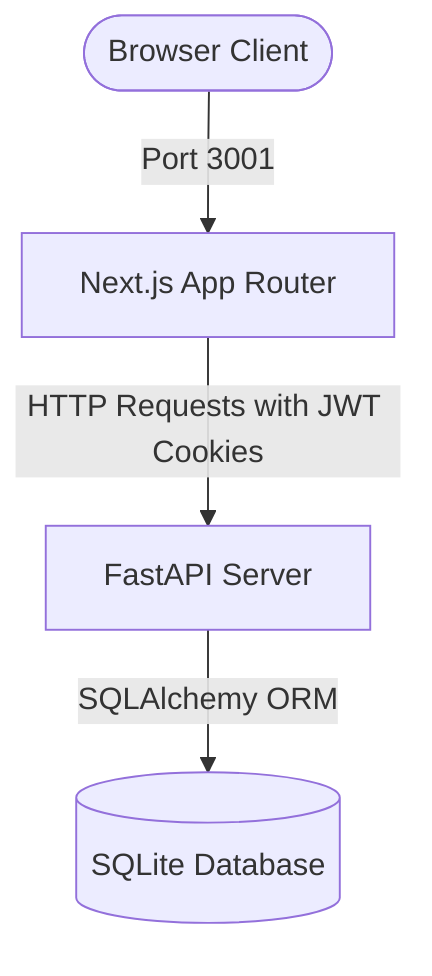

# AWS Route 53 Clone Console

A high-fidelity clone of the Amazon Route 53 web management console. This application lets users create, list, edit, and delete Hosted Zones, manage DNS records across 9 different record types with strict real-world validation rules, and inspect audit activity logs.

---

## 🏛️ System Architecture



- **Frontend**: Next.js App Router built with TypeScript, React Context, and Vanilla CSS styling matching the AWS Console design tokens. Runs on port **`3001`**.
- **Backend**: FastAPI REST API handling validation logic, database events, and JWT authentication. Runs on port **`8000`**.
- **Database**: SQLite database stored locally at `./backend/data/route53.db` with foreign key constraints enabled.

---

## 🗄️ Database Schema

### 1. `User`
Stores user credentials for console login.
- `id` (UUID, Primary Key)
- `email` (String, Unique, Index) - Must be a valid email format.
- `password_hash` (String) - Hashed using bcrypt.
- `name` (String, Optional)
- `created_at` (DateTime)

### 2. `HostedZone`
Represents a DNS zone containing records.
- `id` (UUID, Primary Key)
- `name` (String, Unique, Index) - Must be a valid domain format. Ends with `.`.
- `type` (String) - `"public"` or `"private"`.
- `comment` (String, Optional)
- `record_count` (Integer) - Auto-updated as records are added/removed.
- `created_at` (DateTime)
- `updated_at` (DateTime)

### 3. `DNSRecord`
Represents a single resource record set.
- `id` (UUID, Primary Key)
- `zone_id` (UUID, Foreign Key cascading on delete)
- `name` (String, Index) - Fully qualified domain name (e.g., `www.example.com.`).
- `type` (String) - One of `A`, `AAAA`, `CNAME`, `TXT`, `MX`, `NS`, `PTR`, `SRV`, `CAA`.
- `ttl` (Integer) - Time to live in seconds.
- `value` (String, Optional) - Value for simple record types.
- `extra_json` (JSON / Text, Optional) - Serialized compound fields for `MX`, `SRV`, and `CAA`.
- `created_at` (DateTime)
- `updated_at` (DateTime)

### 4. `ZoneEvent`
Audit trail of actions taken in the hosted zone.
- `id` (UUID, Primary Key)
- `zone_id` (UUID, Foreign Key)
- `event_type` (String) - e.g., `"ZONE_CREATED"`, `"RECORD_CREATED"`, `"RECORD_DELETED"`.
- `description` (String) - Details about the action.
- `created_at` (DateTime)

---

## ⚡ DNS Validation Rules

The backend service enforces strict validation rules matching RFC specifications and Route 53 constraints:

1. **Hostnames & Labels**: Max total length of 253 characters. Individual labels cannot exceed 63 characters and must contain alphanumeric characters, hyphens, and underscores (e.g. for `_sip._tcp`).
2. **IP Addresses**:
   - `A` records must be valid IPv4 addresses (using Python's native `ipaddress` library).
   - `AAAA` records must be valid IPv6 addresses.
3. **CNAME Restrictions**:
   - **Apex Prohibition**: A CNAME record cannot be created at the zone apex (e.g., `example.com.` cannot have a CNAME pointing elsewhere).
   - **Exclusivity**: A CNAME label cannot coexist with other records (e.g., if `www.example.com.` is a CNAME, you cannot add an `A` record with the same name, and vice versa).
4. **Apex Deletion Protection**: Default `NS` and `SOA` records created automatically at the hosted zone apex are protected and cannot be deleted.
5. **Compound Formats**:
   - **MX**: Must contain priority (0–65535) and mail server hostname ending with a trailing dot.
   - **SRV**: Must contain priority, weight, port (0–65535), and target hostname.
   - **CAA**: Must contain flag (0 or 128), tag (`issue`, `issuewild`, `iodef`), and CA value.

---

## 🚀 Setup & Execution Instructions

Ensure you have Python 3.13+ (or 3.14.4) and Node.js 18+ installed on your local system.

### Option A: Local Execution (Recommended for Dev)

#### 1. Database Seeding & Backend Run
Open a terminal in the `/backend` folder:
```bash
# Create Python virtual environment and activate
python -m venv venv
source venv/bin/activate

# Install dependencies (unpinned to prevent package conflicts)
pip install -r requirements.txt

# Run the DB seed script to populate default data (creates admin user & zones)
python seed.py

# Run the FastAPI server locally on port 8000
python -m uvicorn app.main:app --reload --port 8000
```

#### 2. Frontend Console Run
Open a new terminal in the `/frontend` folder:
```bash
# Install Node dependencies
npm install

# Run the Next.js development server locally on port 3001
npm run dev
```
Now, open your browser and navigate to: **[http://localhost:3001](http://localhost:3001)**.

#### Credentials for Login:
- **Email**: `admin@route53.com`
- **Password**: `admin123`

---

### Option B: Docker Orchestration

You can run both services together using Docker Compose. Make sure Docker is running on your machine.

From the workspace root directory:
```bash
# Build images and start services in the background
docker compose up --build -d

# Verify both containers are running (FastAPI on 8000, Next.js on 3001)
docker compose ps
```
To shutdown:
```bash
docker compose down
```
